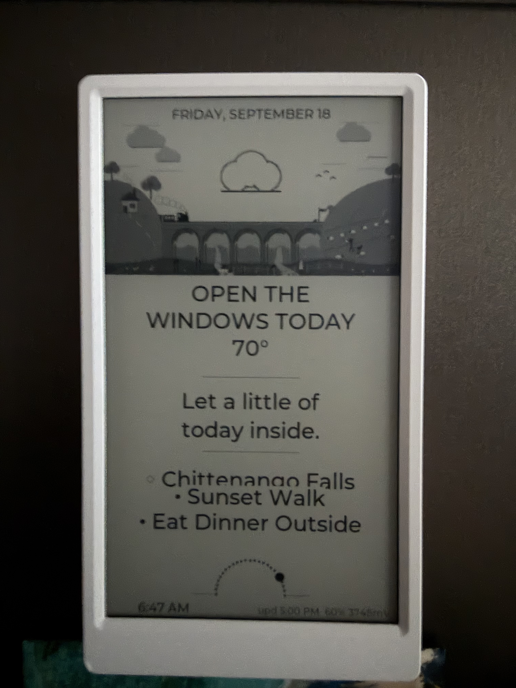
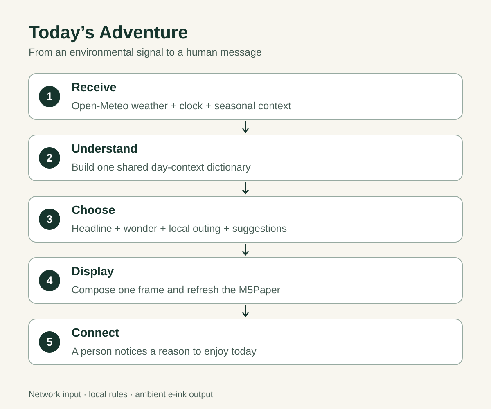

# Today's Adventure: a reason to step outside

*Contest draft, revised September 19, 2026. Physical demonstration video to add.*

“Open the windows today.” Beneath the temperature, the display adds:
“Let a little of today inside.” Then come a nearby outing, a sunset walk,
and dinner outside.

Today's Adventure turns weather and time into an illustrated invitation.
Built on an M5Stack M5Paper v1.1, it sits where a passing glance can become
a small plan for the day.

## From signal to suggestion

Wi-Fi brings in Open-Meteo weather data. Local rules combine it with time,
season, sunrise and sunset to choose a headline, one short “wonder” sentence,
and useful suggestions. A catalog of Syracuse-area destinations supplies a
daily outing when conditions permit.

The rules filter repeated ideas so the headline, sentence and suggestions
do not all tell you to take a walk. Severe weather suppresses the outing.
Night-watch messages draw from a separate pool. These decisions make the
connection meaningful: environmental signals become something a person can
act on.

Text selection runs on the device and is reproducible from its inputs.
No online text-generation request is needed. The screen normally updates
hourly; a wheel press opens a facts card for about a minute.

## Building it

The hardware is one M5Paper v1.1, its battery, and a USB data cable.
Its integrated processor, Wi-Fi, RTC and 540 × 960 portrait e-ink display
need no additional sensor wiring. The application runs under UIFlow2;
the repository records testing with firmware v2.4.9.

1. Clone [the source](https://github.com/Matthewjg95/todays-adventure) and
   install desktop dependencies.
2. Run the logic tests and ASCII demo before connecting hardware.
3. Flash UIFlow2 with M5Burner.
4. Set location and timezone in `config.py`, copy the Wi-Fi credentials
   example, and personalize the outing and event catalogs.
5. Create the scene directories and use `tools/m5link.py` to upload the
   twelve runtime modules, credentials, boot entry and artwork.
6. Reset the board and verify its display and scheduled wakes.

The [build guide](../BUILD_GUIDE.md) supplies dependencies, complete commands
and release instructions. An independent installation should point OTA to its
own fork: the current updater follows upstream `master` and includes configuration.

## Three lessons from the physical build

**Compose a complete frame after waking.** Differential updates were unreliable
after reboot because display-controller state and the visible panel could
disagree. The renderer now composes offscreen and sends one absolute GC16 frame.

**Measure what survives sleep.** The active wake path uses ESP32 deep sleep.
Field observations found intermittent image fading while the display rail was
cut, so the current configuration repaints every normal update. This trades
some refresh cost for readability; retention and battery endurance still need
a documented measurement run.

**Leave clues when something hangs.** A four-minute watchdog can recover a stuck
wake. Persistent stage markers identify the last operation, such as Wi-Fi,
weather fetch or rendering. That turns a silent reset into evidence for the
next debugging session.

## A recent improvement

The September 18 photo revealed that the destination and first suggestion were
too close together. The renderer reserved only 32 pixels before the next row
while displaying a 40-point destination.

The fix reserves the whole line height plus spacing and reduces text size on
crowded screens. It passed 47 desktop tests, including four layout regressions,
and was published through the hash-checked OTA mechanism. On September 19, the
owner reported that spacing on the device was much better.

This is a useful example of the project's development cycle: observe the actual
screen, reproduce the fault, test the change, and deliver it without a cable.
A new physical photo will show the improvement; the opening photo is retained
as the earlier state.

## Demonstration and next steps

The physical video will show the main screen, an uncut refresh, and the
facts-card interaction. A short gallery of day, night and wet-weather screens
will demonstrate how the message changes with context.

Desktop tests cover selection logic and render execution, but do not establish
panel retention or battery life. The next evidence target is a recorded
24–48-hour run with wake counts, reset stages and battery readings.
The updater verifies downloaded hashes; it does not provide automatic rollback
during an interrupted installation.

## Source and credits

The [MIT-licensed repository](https://github.com/Matthewjg95/todays-adventure)
includes reproducible Python/Pillow scene generators. Development used
AI-assisted coding and illustration alongside physical testing.
Weather data comes from [Open-Meteo](https://open-meteo.com/);
hardware and firmware resources come from [M5Stack](https://docs.m5stack.com/en/download).

The aim is simple: a glance at the display should leave someone with something
worth noticing or doing today.
